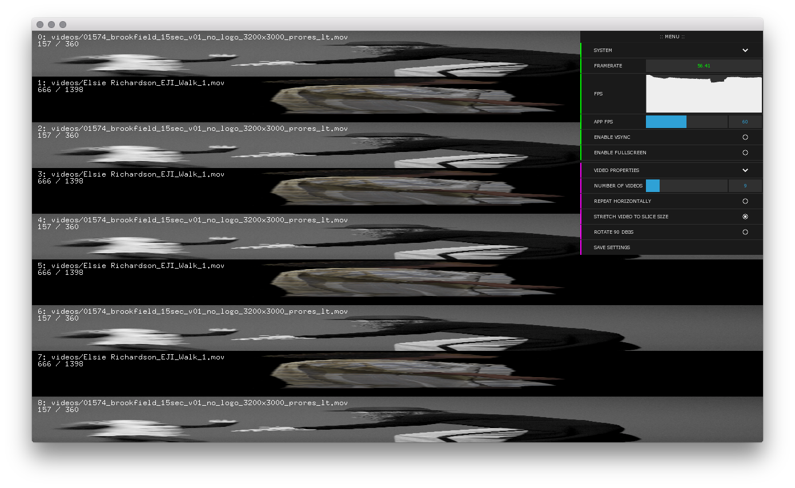

#videoBench

Standalone tool for testing playback and drawing of multiple videos in openFrameworks.

#### Requires
- oF 0.9~
- ofxDatGui
- ofxJsonSettings + ofxJson

Just `git submodule init` and `git submodule update`.

#### Usage
- Place one or more videos in `data/videos`
- Upon launch videoBench will create an ofVideoPlayer for each file and begin to `play()` them all.

Turning up the "number of videos" will `draw()` additional copies of the videos that have loaded-- if you have less video files loaded than the slider additional copies of that videoPlayer will be drawn.

#### Features
- Multi-monitor full screen
- App wide framerate control
- Vsync control
- Video draw scaling and rotation

#### Additional controls
- 'g' to toggle gui drawing.
- 'd' to toggle debug text drawing.